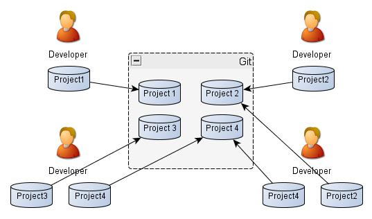
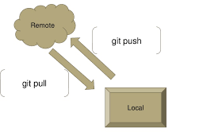
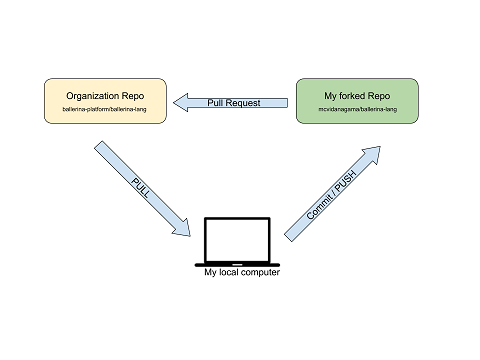
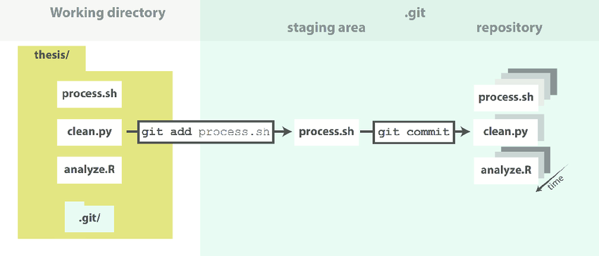
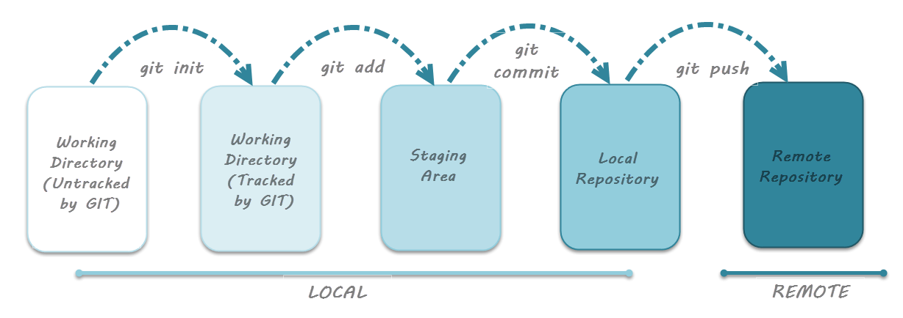

# Git Basics 
## **What is git ?**
Git is _**version-control**_ software that helps the software developers to _**collaborate with each other**_.
Version control system helps to maintain history of changes that are made into the software.
##  **Required terminology**
-	#### **Repository:**
    
	-	It is _**container**_ or we can say big box where contains all the files and folder and it is used by the git to keep track.
	-	The repository stores _**number of projects**_ and each project is shared among the team.Thus the _**access privilege**_ is given to each authorized team member.
-	#### **Commit:**
    
	-	Commit is nothing but the saving your work.when you enter the commit command to repository then it take the _**pictures/snapshots**_ of the files which are present at the time.
	-	Result of the commit command only affects on local repository.
	-   The function of _**version control**_ is managed by the commit,where it stores the previous all version of the software
-	#### **Push & Pull:**
    
	-	Push is to make _**actual changes**_ into _**remote repository**_ by syncing from local repository.
	-	Pull command is used to _**download and integrate remote changes**_.
-	#### **Branch:**
    
	-	Assume the git repository as a tree,so that the main software is called as master branch and all remain branches of that tree is called as branches.
	-	Branches are _**separate instance**_ of the code that is different from master branch/main codebase.
	-	It helps to dividing the work into number of branches by giving seprate copy of codebase.Once all work is done and error free it will _**merge**_ it back to master branch
-	#### **Merge:**
     
	-	It is kind of _**integration**_ related to two branches where it helps to merge the branch with the master branch when branch is free of bugs.
-	#### **Clone:**
	-	Cloning is taking _**copy of entire online repository**_ into the local machine.
-	#### **Fork:**
    
	-	Fork is similar to Clone except it takes entirely new repo of that code _**under your own name**_. 
	-	A forked repository differs from a clone in that a connection exists between your fork and the original repository itself.
	-	In this way, your fork acts as a bridge between the original repository and your personal copy where you can contribute back to the original project using Pull Requests.
## **Git Internals**
**States related to file:**
- **1. Modified:** 
	- file is changed but not committed to local repository.
	- this is genral modification of file content through notepad and any file editor.
- **2. Staged:**
    -   Before commit, You have to fire the _**git add**_ command and tranfer file state from modified to staged.
    -   Once command is fired, Check status by using _**git status**_ command.
	-	Marking the modified files in current version to go into next picture/snapshot is **staging**.
-	**3. Commited:**
	-	data is safely stored and changed in local repo in form of pictures/snapshots.
	-	To commit the file you have to fire the _**git commit**_ command.
	

There are **3/4** different tress are maintained at one time of instance for your software **code/repository**.
>_Workspace, Staging, Local Repository, Remoter Repository_
  
## Git commands:
#### Getting & Creating Projects

| Command | Description |
| ------- | ----------- |
| `git init` | Initialize a local Git repository |
| `git clone ssh://git@github.com/[username]/[repository-name].git` | Create a local copy of a remote repository |

#### Basic Snapshotting

| Command | Description |
| ------- | ----------- |
| `git status` | Check status |
| `git add [file-name.txt]` | Add a file to the staging area |
| `git add -A` | Add all new and changed files to the staging area |
| `git commit -m "[commit message]"` | Commit changes |
| `git rm -r [file-name.txt]` | Remove a file (or folder) |

#### Branching & Merging

| Command | Description |
| ------- | ----------- |
| `git branch` | List branches (the asterisk denotes the current branch) |
| `git branch -a` | List all branches (local and remote) |
| `git branch [branch name]` | Create a new branch |
| `git branch -d [branch name]` | Delete a branch |
| `git push origin --delete [branch name]` | Delete a remote branch |
| `git checkout -b [branch name]` | Create a new branch and switch to it |
| `git checkout -b [branch name] origin/[branch name]` | Clone a remote branch and switch to it |
| `git branch -m [old branch name] [new branch name]` | Rename a local branch |
| `git checkout [branch name]` | Switch to a branch |
| `git checkout -` | Switch to the branch last checked out |
| `git checkout -- [file-name.txt]` | Discard changes to a file |
| `git merge [branch name]` | Merge a branch into the active branch |
| `git merge [source branch] [target branch]` | Merge a branch into a target branch |
| `git stash` | Stash changes in a dirty working directory |
| `git stash clear` | Remove all stashed entries |

#### Sharing & Updating Projects

| Command | Description |
| ------- | ----------- |
| `git push origin [branch name]` | Push a branch to your remote repository |
| `git push -u origin [branch name]` | Push changes to remote repository (and remember the branch) |
| `git push` | Push changes to remote repository (remembered branch) |
| `git push origin --delete [branch name]` | Delete a remote branch |
| `git pull` | Update local repository to the newest commit |
| `git pull origin [branch name]` | Pull changes from remote repository |
| `git remote add origin ssh://git@github.com/[username]/[repository-name].git` | Add a remote repository |
| `git remote set-url origin ssh://git@github.com/[username]/[repository-name].git` | Set a repository's origin branch to SSH |

#### Inspection & Comparison

| Command | Description |
| ------- | ----------- |
| `git log` | View changes |
| `git log --summary` | View changes (detailed) |
| `git log --oneline` | View changes (briefly) |
| `git diff [source branch] [target branch]` | Preview changes before merging |

## Git Workflow 

### For Quick Reference >>> <a href="https://about.gitlab.com/images/press/git-cheat-sheet.pdf" target="_blank">Git Cheat Sheet</a>

