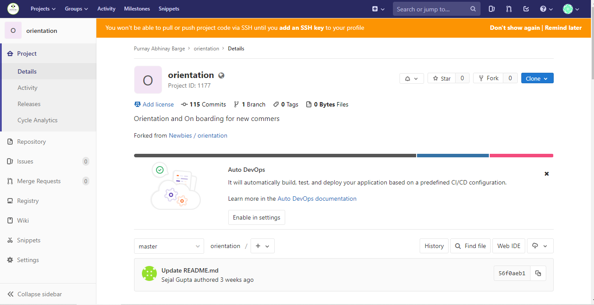

# GitLab Summary

**GitLb** is **web-based DevOps** life cycle tool that provides a git repository manager providing **WiKi, Issue-Tracking & CI/CD pipeline features,** using an open-source license, developed by GitLab Inc.

GitLab is an **open-source 'clone'** which we can use it on our servers for free.
**<a href="https://medium.com/@Brickblock/why-we-use-gitlab-8829a7712c3b" target="_blank">Why we use GitLab?</a>**

## Markdown
**Markdown** is used by GitLab to render any files with the `.md` extension. This is a good way to create some documentation for a project.

### Header
To create headers put a hash symbol `#` before the text.

```
# H1
## H2
### H3
```
### Emphasis 

```
Italics - *asterisks* or _underscores_

Bold - **asterisks** or __underscores__

Combined emphasis - **asterisks and _underscores_**

Strikethrough uses two tildes, ~~Scratch this~~
```
#### <a href="https://markdown-guide.readthedocs.io/en/latest/basics.html" target="_blank">Detailed Information about Markdown</a>
## Dashboard

After you log in you will see the Dashboard. The dashboard can be navigated by using the bar on the left, these will show information about all projects and groups that you are members of.


## Project 

Once you click on a project you will be navigated to a page which is similar to the main Dashboard, you can see the activity of the project or view the readme. At the side of the screen is a similar menu used to navigate the project. Below is a basic explanation of what most of them do.



## Commits
**Commits** Allows you to see the latest additions to the repository for each branch. Also allows you to compare the differences between commits or branches.

## Issues
**Issues** Allows users to submit bugs or enhancements. This is where to do lists are stored, as GitLab markdown in project files does not support checkboxes.

## Wiki
A separate system for documentation called **Wiki**, is built right into each GitLab project. It is enabled by default on all new projects and you can find it under Wiki in your project.

## Merge Requests
**Merge Request** Allows a user to submit a request to merge two branches together if they do not have permission to merge them. Users can comment and suggest changes, and if they have the permission they can also complete the merge.

## Snippets
If enabled on the project it allows users to paste some code that they need to save.


